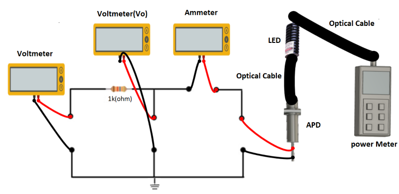

### Introduction

If a photon having adequate energy \[should be greater than the band gap\] is absorbed by a p-n junction, an electron will be transferred to the conduction band, thereby forming a hole in the valence band. As a result, an open circuit voltage is created and a current will flow, provided the circuit is closed through a load resistor. In case of reverse bias p-n junction, the transit time can be made small and it will produce current linearly proportional to the incident photon energy. The frequency response can be improved if the p-n junction is separated by an intrinsic region.

The introduction of the intrinsic region decreases the junction capacitance. This is called ‘Positive Intrinsic Negative’ \[PIN\] photo diode. For high frequency operation, the PIN diode can be made as small as practical, to match the size of the spot of the optical beam. A reverse bias junction can produce secondary emission under high field conditions. It can result in a noiseless gain and a large reverse current will flow across the junction. This is known as ‘Avalanche action’ and the diode is referred to as ‘Avalanche Photo diode’ \[APD\]. It has internal gain and its responsivity is better than that of PN or PIN photodiode. Its internal gain yields much better S/N.

**Figure 1: Set up for Characteristics of Avalanche Photo Diode(APD)**

